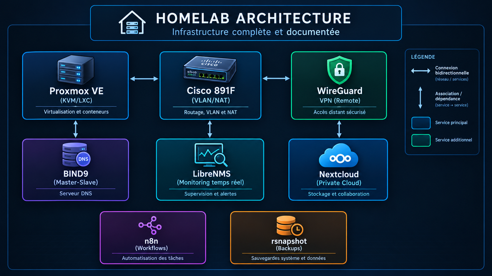

<Header>

<!-- ═══════════════════════════════════════════════════════════════ -->
<!--  ██████╗ ██╗███████╗ ██████╗██████╗ ███████╗████████╗        -->
<!--  ██╔══██╗██║██╔════╝██╔════╝██╔══██╗██╔════╝╚══██╔══╝        -->
<!--  ██║  ██║██║███████╗██║     ██████╔╝█████╗     ██║           -->
<!--  ██║  ██║██║╚════██║██║     ██╔══██╗██╔══╝     ██║           -->
<!--  ██████╔╝██║███████║╚██████╗██║  ██║███████╗   ██║           -->
<!--  ╚═════╝ ╚═╝╚══════╝ ╚═════╝╚═╝  ╚═╝╚══════╝   ╚═╝           -->
<!--  ═══════════════════════════════════════════════════════════════ -->

  

  

<!-- ── Badge identité : pragmatique, ambitieux, rigoureux ── -->

  

  <em>« On me remarque quand ça casse. On me remercie quand ça tourne. »</em>

<Header>

---

## 🎯 À propos / About

| 🇫🇷 Français | 🇬🇧 English |
|---|---|
| Étudiant en bachelor **Administrateur systèmes, réseaux et sécurité informatiques** (Bac+3, 2026-2027). | Studying for a bachelor's degree in **Systems, Networks and IT Security Administration** (Bac+3, 2026-2027). |
| Passionné par l'infrastructure **réelle**, où les connaissances théoriques prennent vie dans des systèmes concrets en fonctionnement 24/7. | Passionate about **real-world** infrastructure, where theoretical knowledge comes to life in practical systems running 24/7. |
| Mon homelab est mon portfolio technique. | My homelab is my technical portfolio. |
| **Objectif** : trouver une alternance en administration systèmes et réseaux, puis devenir expert en infrastructure. | **Goal**: secure a work-study position in systems and network administration, then become an infrastructure expert. |

---

## 🛠️ Tech Stack

  

| Domaine | Technologies |
|---|---|
| **Virtualisation** | Proxmox VE (KVM/LXC), Docker & Docker Compose |
| **Réseaux** | Cisco 891F (VLAN, NAT, routage statique), BIND9 (DNS maître-esclave) |
| **Sécurité** | WireGuard VPN, segmentation VLAN, pare-feu |
| **Monitoring** | LibreNMS (surveillance temps réel) |
| **Infrastructure** | n8n (automatisation), Nextcloud (cloud privé), rsnapshot (sauvegardes) |
| **OS** | Debian/Ubuntu Linux, Cisco IOS |

---

## 🏗️ Homelab Portfolio

> **Mon homelab est une infrastructure complète et documentée. Ce n'est pas un jouet : c'est une infrastructure réelle.**

  

| Service | Description | Statut |
|---|---|---|
| **Virtualisation** | Proxmox + VMs pour services critiques | ✅ Production |
| **DNS** | BIND9 master-slave avec zones personnalisées | ✅ Production |
| **Routage** | Cisco 891F avec des VLAN segmentés et du NAT | ✅ Production |
| **Monitoring** | LibreNMS pour surveillance temps réel | ✅ Production |
| **Sauvegardes** | rsnapshot (RTO/RPO définis) | ✅ Production |
| **Cloud privé** | Nextcloud pour stockage/sync sécurisé | ✅ Production |
| **VPN** | WireGuard pour un accès à distance sécurisé | ✅ Production |
| **Automatisation** | n8n pour les flux de travail liés à l'infrastructure | ✅ Production |

> **Pourquoi ?** Pour relier les connaissances théoriques à la pratique et comprendre le fonctionnement des systèmes sur du matériel réel, avec ses contraintes.

---

## 📋 Parcours

| Période | Formation | Établissement |
|---|---|---|
| **2024-2025** | BTS SIO SISR (infrastructure systèmes et réseaux) | Lycée Jean Bart, Dunkerque |
| **2026-2027** | Bachelor **Administrateur systèmes, réseaux et sécurité informatiques** (Bac+3) | France — en cours |

---

## 🚀 Ouvert aux opportunités

- 🔹 **Alternance de 12 mois ou plus** — administration systèmes, réseaux ou cybersécurité (France/Belgique)
- 🔹 **Défis d'infrastructure concrets** — au-delà de la configuration : dépannage et résolution de problèmes
- 🔹 **Collaboration** sur des projets de homelab ambitieux

---

## 📧 Contact

  
  
  

---

## 🌿 Philosophie

### 🎯 Mes valeurs

| Qualité | Description |
|---|---|
| **Pragmatique** | J'aime les innovations qui changent réellement les choses et permettent de résoudre des problèmes concrets. Mon homelab est mon laboratoire pour tester et apprendre. |
| **Ambitieux** | Je veux construire des solutions utiles. Qu'il s'agisse d'infrastructure, d'automatisation ou de services, je veux que mon travail ait un impact concret. |
| **Rigoureux** | J'apprends en permanence, car la technologie évolue vite. Je m'efforce de comprendre comment les choses fonctionnent, plutôt que de me contenter de les faire fonctionner. C'est ainsi qu'on innove. |

---

  

  <strong>Made simple. Everything works. No bloat.</strong> 🎯

  Last updated: September 2026

